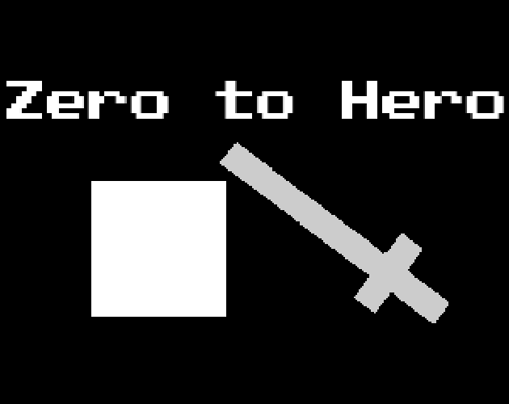

# Zero to Hero
In Zero to Hero, a puzzle-platformer, you control a formless shadow blob that slowly learns to mimic the abilities of fallen heroes. Starting as an amorphous entity, you gradually acquire movement and  skills like legs to jump higher,  arms to push objects, and a sword to slash objects—each upgrade expanding your traversal options and puzzle-solving capabilities in a Metroidvania-inspired progression. 

This game was made in 66 non consecutive hours for the First Dev Jam 2025

## Development

### Requirements
- [npm](https://www.npmjs.com/)
- [clojure](https://clojure.org/)

### Instructions

#### Bootstrap
```bash
npm install
```

#### Watch on http://localhost:5000
```bash
npm run watch
```

#### Release Build (release/public)
```bash
npm run release
```

##### Serve Release bundle
```bash
gzip resources/public/js/*.js
npx http-server resources/public -g
```

##### Generate Zip for itch.io
```bash
cd resources/public && zip -r zero.zip * && cd ../../
```

## Controlers

- Movement
  - **A** or **Left Arrow**
  - **D** or **Right Arrow**
  - **Space**, **W** or **Up Arrow**
- Change Form
  - **S** or **Down Arrow**
- Attack
  - **Shift**
- Music Toggle
  - **M**

## Acknowledgements
People that helped testing the development builds

- [Gustavo Passos](https://github.com/theGusPassos)
- [Lucas Bertin](https://github.com/lucascebertin)
- [Lucas Teles](https://github.com/lucasteles)
- [Luiz Strobelt](https://github.com/strobelt)

## Tools
- [aseprite](https://www.aseprite.org/)
- [tiled](https://www.mapeditor.org/)

## Credits
- Background Tiles: https://kenney.nl/assets/1-bit-platformer-pack
- Font: https://ggbot.itch.io/public-pixel-font
- SFX: https://kronbits.itch.io/freesfx
- Music: https://safetystoatstudios.itch.io/free-vgms

## License

### Code
This is free and unencumbered software released into the public domain.  
For more information, please refer to <http://unlicense.org>

### Assets
The person who associated a work with this deed has dedicated the work to the public domain by waiving all of his or her rights to the work worldwide under copyright law, including all related and neighboring rights, to the extent allowed by law.  
For more information, please refer to https://creativecommons.org/publicdomain/zero/1.0/
